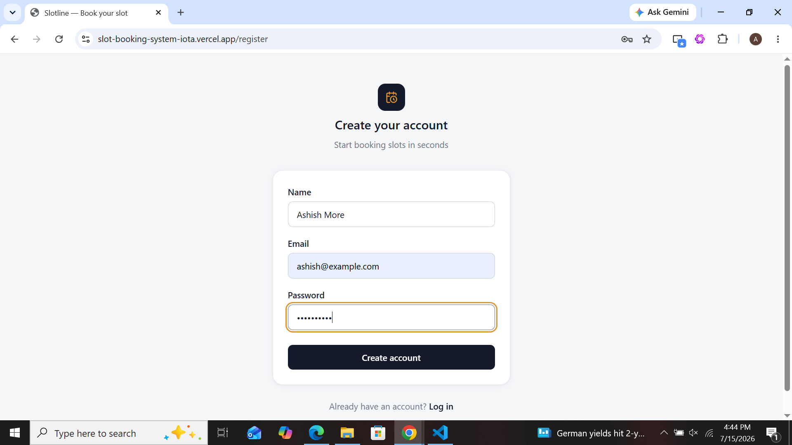
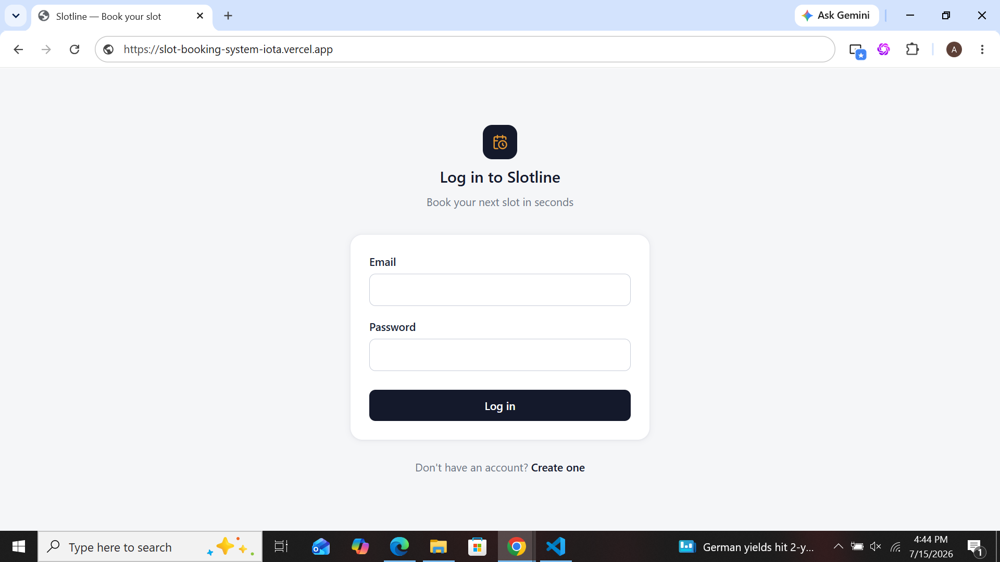
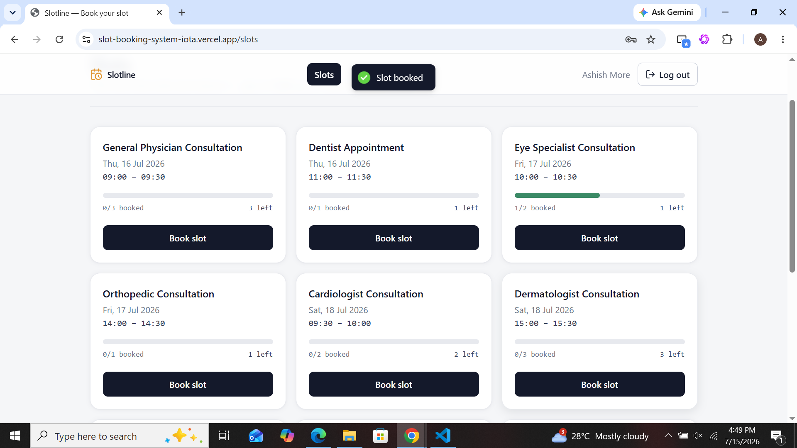
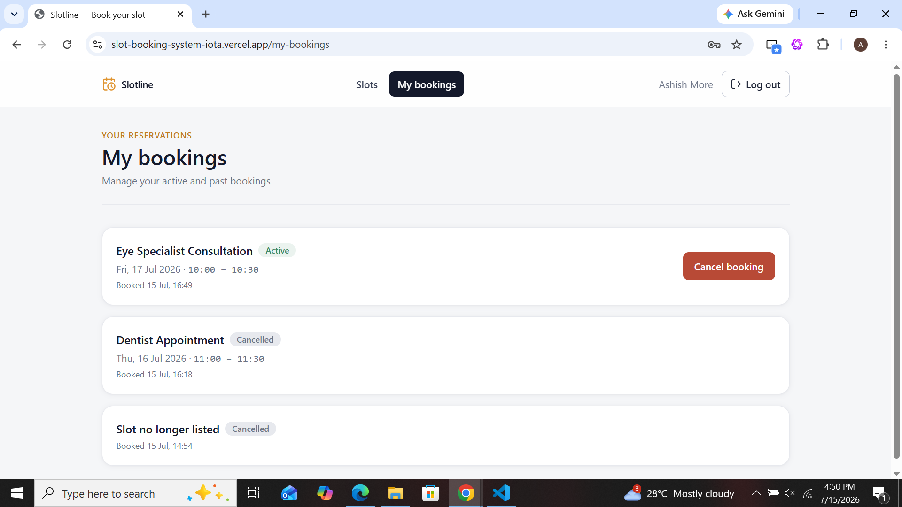
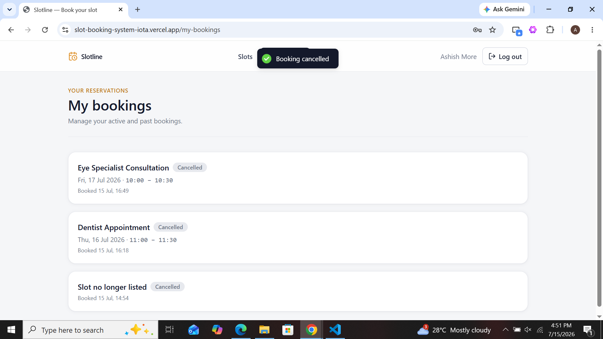

# Slotline  Slot Booking System

A full-stack Slot Booking System built using **Next.js (App Router)**, **TypeScript**, **Node.js**, **Express.js**, and **MongoDB**.

The application allows users to register, log in, view available appointment slots, book available slots, manage their bookings, and cancel existing bookings while ensuring that slot capacity is never exceeded, even under concurrent requests.

---

#  Features

## Authentication

- User Registration
- User Login
- JWT Authentication
- Password Hashing using bcrypt
- Protected Routes

---

## Slot Management

- View all available slots
- Display remaining slot capacity
- Disable booking when slot is full
- Automatic UI update after booking

---

## Booking Management

- Book available slots
- View My Bookings
- Cancel Booking
- Automatic slot availability update after cancellation

---

## Business Rules

- A slot can never exceed its maximum capacity.
- A user can have a maximum of **2 active bookings**.
- Duplicate active bookings for the same slot are prevented.
- Only the booking owner can cancel their booking.

---

#  Tech Stack

## Frontend

- Next.js 15 (App Router)
- React 19
- TypeScript
- Tailwind CSS
- Axios
- React Hook Form
- Zod
- Context API
- React Hot Toast
- Lucide React

---

## Backend

- Node.js
- Express.js
- TypeScript
- MongoDB
- Mongoose
- JWT
- bcrypt
- express-validator

---

#  Project Structure

```text
slot-booking-system/

├── backend/
│
├── frontend/
│
└── README.md
```

---

#  Backend Architecture

```text
backend/

src/

config/

constants/

controllers/

database/

middlewares/

models/

routes/

services/

validators/

utils/

types/

app.ts

server.ts
```

---

#  Frontend Architecture

```text
frontend/

src/

app/

login/

register/

slots/

my-bookings/

components/

services/

context/

hooks/

types/

utils/

lib/
```

---

#  Authentication Flow

```text
Register

↓

Login

↓

JWT Generated

↓

Stored on Client

↓

Axios Interceptor

↓

Authorization Header

↓

Protected Backend APIs
```

---

#  API Endpoints

## Authentication

| Method | Endpoint |
|---------|----------|
| POST | /api/auth/register |
| POST | /api/auth/login |

---

## Slots

| Method | Endpoint |
|---------|----------|
| GET | /api/slots |
| POST | /api/slots/:id/book |

---

## Bookings

| Method | Endpoint |
|---------|----------|
| GET | /api/bookings/me |
| DELETE | /api/bookings/:id |

---

# Database Schema

## User

- name
- email
- password

---

## Slot

- title
- date
- startTime
- endTime
- capacity
- bookedCount

---

## Booking

- user
- slot
- status

---

#  How Double Booking Was Prevented

The booking endpoint is designed to be race-safe.

Instead of reading the slot, checking capacity, and then updating it (which can lead to race conditions), the application uses an **atomic MongoDB update**.

The booking logic performs a conditional `findOneAndUpdate()` operation with a capacity check and `$inc` in a single database operation. This ensures that multiple concurrent requests cannot increase the booked count beyond the slot's capacity.

If the slot has already reached its maximum capacity, MongoDB does not update the document and the API returns **HTTP 409 Conflict**.

This guarantees that slot capacity is never exceeded, even under simultaneous booking requests.

---

#  Trade-offs

To keep the project focused on the assignment requirements:

- Used JWT authentication instead of OAuth.
- Used MongoDB with Mongoose for simplicity.
- Kept the UI minimal and responsive instead of adding complex animations.
- Focused on clean architecture and business logic instead of unnecessary features.
- Used Context API instead of Redux because the application's state is relatively small.

---

#  What I Would Improve With More Time

- Docker support
- Unit Tests
- Integration Tests
- End-to-End Testing (Playwright/Cypress)
- Admin Dashboard
- Slot Creation & Management
- Email Notifications
- Refresh Token Authentication
- Pagination
- Search & Filters
- Booking History
- Rate Limiting
- Audit Logs
- CI/CD Pipeline
- Deployment (Vercel + Render)

---

#  Setup Instructions

## Clone Repository

```bash
git clone <repository-url>

cd slot-booking-system
```

---

## Backend

```bash
cd backend

npm install
```

Create a `.env` file.

```env
PORT=5000

MONGODB_URI=your_mongodb_connection_string

JWT_SECRET=your_secret_key
```

Run backend

```bash
npm run dev
```

---

## Seed Database

```bash
npm run seed
```

---

## Frontend

```bash
cd ../frontend

npm install
```

Create a `.env.local`

```env
NEXT_PUBLIC_API_URL=http://localhost:5000/api
```

Run frontend

```bash
npm run dev
```

Open

```
http://localhost:3000
```

---

#  Testing Flow

1. Register a new user.
2. Login.
3. Browse available slots.
4. Book an available slot.
5. Verify remaining capacity updates.
6. View "My Bookings".
7. Cancel a booking.
8. Verify slot availability updates after cancellation.
9. Attempt a third active booking (should fail).
10. Attempt duplicate booking for the same slot (should fail).
11. Attempt booking on a full slot (should return HTTP 409).

---

#  Application Screenshots

##  Register Page



---

##  Login Page



---

##  Available Slots


---

##  Booking a Slot



---

##  My Bookings



---

##  Cancel Booking



---

#  Assignment Requirements Covered

-  Register
-  Login
-  JWT Authentication
-  Password Hashing
-  Slot Listing
-  Remaining Capacity
-  Book Slot
-  Cancel Booking
-  Ownership Validation
-  Prevent Duplicate Booking
-  Maximum 2 Active Bookings Rule
-  Atomic Booking Logic
-  Proper HTTP Status Codes
-  Input Validation
-  Responsive UI
-  Loading & Error States
-  TypeScript
-  Clean Architecture

---

#  Author

**Ashish More**

Full Stack Developer

Tech Stack:
Node.js • Express.js • Next.js • React • TypeScript • MongoDB
